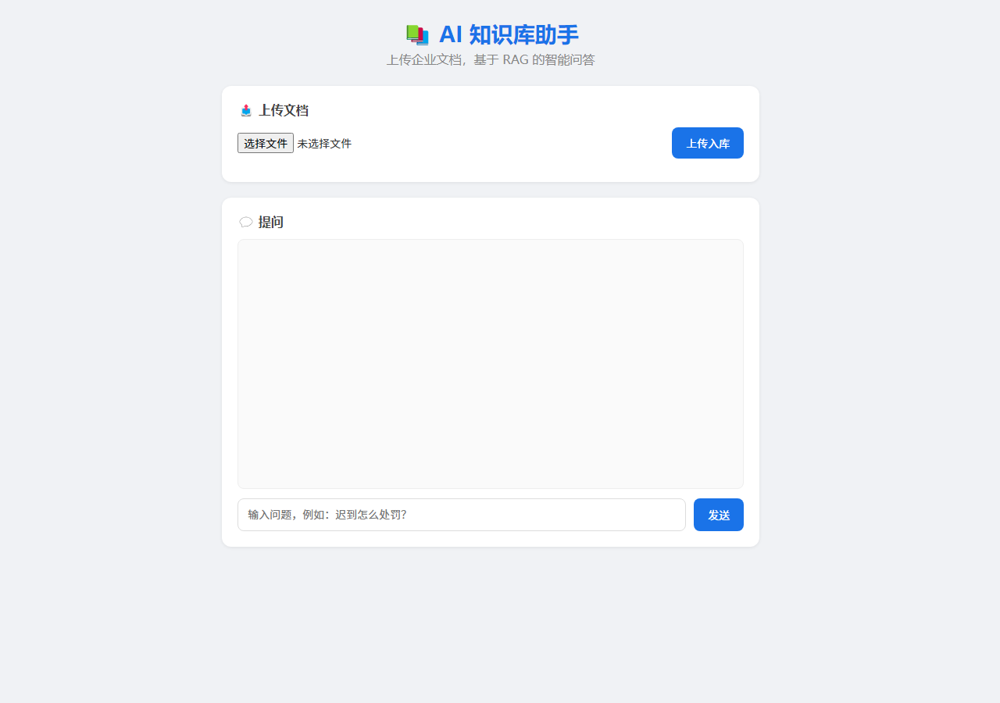

# AI Knowledge Assistant · 企业知识库智能问答系统

基于 **RAG（检索增强生成）** 架构的企业知识库智能问答系统：上传企业文档（PDF / TXT / Markdown / Word）→ 系统自动解析、切片、向量化并建立知识库 → 用户提问时先检索最相关的内容，再由大模型生成**有依据的回答**，解决大模型不了解企业私有知识、容易"幻觉"的问题。

## ✨ 核心亮点

- **有据可查**：回答附带引用来源片段（Top-3 相似文本），不是凭空生成
- **中文优化**：BGE 中文 Embedding 模型，中文语义检索效果好
- **本地知识库**：FAISS 向量检索，文档不上传云端，隐私可控
- **多轮对话**：携带最近 4 轮对话上下文，追问不丢语境

## 🛠️ 技术栈

Python | Flask | BGE Embedding (sentence-transformers) | FAISS | DeepSeek API | PyMuPDF | python-docx

## 🏗️ 项目结构

```
AI-Knowledge-Assistant/
├── app/          # Web 层（Flask 入口 / 路由 / 配置）
├── core/         # 核心引擎（文档解析 / 切片 / 向量化 / 检索 / LLM）
├── data/
│   ├── documents/  # 用户上传的文档
│   └── vector_db/  # FAISS 向量库索引（.faiss + .documents.json 成对保存）
├── frontend/     # 前端页面（聊天界面 / 文件上传）
├── models/       # 本地 BGE 模型（不入库，见下方说明）
└── screenshots/  # 运行截图
```

## 🚀 快速开始

### 1. 环境准备（Python 3.10+）

```bash
python -m venv .venv
.venv\Scripts\activate        # Windows
# source .venv/bin/activate  # macOS / Linux
pip install -r requirements.txt
```

### 2. 配置 API Key

在项目根目录创建 `.env` 文件（已被 .gitignore 排除，不会上传）：

```
DEEPSEEK_API_KEY=sk-xxxxxx
```

### 3. 启动服务

```bash
python -m app.main
```

> ⚠️ 注意：必须用 `-m` 模块方式启动。直接 `python app/main.py` 会报 `No module named 'app'`（Python 找不到项目根目录的包）。

启动成功后访问 **http://127.0.0.1:5000**

### 4. 使用流程

1. 点击 **选择文件** 上传文档（PDF/TXT/MD/DOCX）
2. 等待系统完成解析 → 切片 → 向量化 → 入库
3. 在提问框输入问题，回答会附带引用来源

## 📸 运行截图



## 🧪 接口一览

| 接口 | 方法 | 说明 |
|---|---|---|
| `/` | GET | 前端聊天页面 |
| `/upload` | POST | 上传文档（multipart 文件字段 `file`）|
| `/chat` | POST | 问答（JSON：`question` + 可选 `history`）|
| `/history` | GET | 最近 20 条问答历史 |
| `/health` | GET | 健康检查（返回知识库片段数）|

## 🚧 开发状态

- [x] Stage 1：项目初始化（目录结构 + 本 README）
- [x] Stage 2：文档处理（PDF/TXT/MD/Word 解析 + 文本切片）✅ `core/document_loader.py` `core/splitter.py`
- [x] Stage 3：Embedding（BGE 中文模型文本向量化）✅ `core/embedding.py`
- [x] Stage 4：FAISS 知识库（向量存储 + Top-K 相似度检索）✅ `core/vector_store.py`
- [x] Stage 5：RAG 流程（Retriever + Prompt + DeepSeek 调用）✅ `core/retriever.py` `core/llm.py`
- [x] Stage 6：Flask 接口（上传 API + 问答 API + 历史）✅ `app/main.py` `app/routes.py` `app/config.py`
- [x] Stage 7：Web 页面（聊天 + 上传）✅ `frontend/index.html` `style.css` `app.js`
- [x] Stage 8：项目优化（多轮对话 + 引用来源）✅ 全部 Stage 完成！
- [x] 稳定性修复：知识库索引与文本列表成对持久化（重启不丢）、错误提示中文化

> 模型文件（BGE）不入库：clone 后按 README 说明下载，或使用 `models/bge-small-zh-v1.5` 本地路径。
